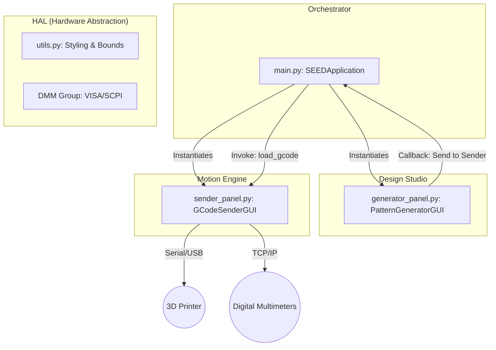

# SEED Control Center: Technical Documentation Package (Software)

This document serves as the high-fidelity technical reference for the SEED Control Center software suite. It follows industry standards for Domain-Driven Design (DDD) and Safety-Critical systems documentation, organized for rapid engineering lookup.

---

## 1. System Architecture & Component Model

The system is designed as a **Modular Hardware Orchestrator**. It leverages Python's multi-threading capabilities to isolate low-latency hardware control (Printer/DMM) from the high-level User Interface.

### 1.1 Logical Domain Map

---

## 2. Safety-Critical Logic Analysis

### 2.1 Emergency Stop (E-STOP) Architecture
**Criticality**: High. Must ensure physical motion cessation within <200ms.

| Component | Responsibility | Mechanism |
| :--- | :--- | :--- |
| `main.py` | UI Trigger | Global Canvas Overlay (Always Interactive) |
| `sender_panel.py` | Protocol Execution | `M112` / `M410` Command Injection |
| `threading.Lock` | Mutex | Prevents Serial Port contention during HALT |

**The "HALT" Sequence**:
1. **Interrupt**: User clicks the red hexagon overlay.
2. **Immediate Lock**: The UI thread attempts to seize `serial_lock`.
3. **Protocol Injection**: `M112` (Emergency Stop) is sent directly to the serial buffer.
4. **Firmware Reset**: The Ender 3 motherboard kills all motors and heaters; software disables all movement controls.

### 2.2 Coordinate Guarding (No-Crash Logic)
Every move requested by the user or a scan file is passed through validation logic to protect physical hardware.

| Guardrail | Logic Source | Hardware Purpose |
| :--- | :--- | :--- |
| **Software Endstops** | `PRINTER_BOUNDS` | Rejects moves outside 0-220mm range. |
| **Z-Max Homing** | `Z_MAX_LIMIT_PIN` | Homes to top (safe) instead of bottom (bed crash risk). |
| **Silent Validation** | `_check_printer_bounds` | Pre-validates paths in Design Studio before execution. |

---

## 3. Data Correlation & Stability Engine

| Stage | Process | Logic / Threshold |
| :--- | :--- | :--- |
| **1. Polling** | Hardware Read | 10Hz TCP/IP polling via `pyvisa`. |
| **2. Windowing** | Data Buffer | Rolling window of 10 samples per instrument. |
| **3. Detection** | Stability Check | `StdDev(Window) < stability_threshold`. |
| **4. Logging** | CSV Export | Syncs XYZ coordinates with averaged stable DMM data. |

---

## 4. Functional Reference (The Interface Map)

### Domain: The Orchestrator (`main.py`)
**Role**: Initializes application, manages tabs, and hosts safety UI.

#### Class: `SEEDApplication`
**Description**: The SEEDApplication class serves as the main entry point and root orchestrator for the SEED Control Center.  It handles the initialization of the primary Tkinter window, manages navigation between different  application modules (Pattern Generator and G-Code Sender) via a tabbed interface, and implements  global safety features such as the Emergency Stop (E-STOP).  To extend the system with new functionality, engineers should create new GUI panel classes  and register them as additional tabs within the 'notebook' container.

**Instance Interface (State)**:
| Variable | Initial Value | Description |
| :--- | :--- | :--- |
| `self.root` | `root` | Primary Tkinter window instance used as the application's root |
| `self.notebook` | `ttk.Notebook(self.root, style='TNotebook')` | Multi-tab container for navigating between system modules |
| `self.generator_tab` | `ttk.Frame(self.notebook, style='TFrame')` | Logical container frame for the scan pattern design interface |
| `self.sender_tab` | `ttk.Frame(self.notebook, style='TFrame')` | Logical container frame for hardware communication and logging |
| `self.generator_panel` | `PatternGeneratorGUI(self.generator_tab)` | Logic and UI controller for scan path design and G-Code export |
| `self.sender_panel` | `GCodeSenderGUI(self.sender_tab)` | Logic and UI controller for hardware control and real-time status |

**Functional Interface (Logic)**:
| Method | Description | Key Side-Effects / Calls |
| :--- | :--- | :--- |
| `__init__()` | Initializes the main application environment, styles, and functional panels | `Frame, GCodeSenderGUI, Notebook, PatternGeneratorGUI, _setup_estop_button, add, configure, geometry` |
| `_handle_send_to_sender()` | Manages the integration workflow between the Pattern Generator and the G-Code Sender | `load_gcode_file, select` |
| `_setup_estop_button()` | Configures and displays the global Emergency Stop (E-STOP) overlay | `Canvas, config, create_polygon, create_text, emergency_stop, itemconfig, place, tag_bind` |

### Domain: The Design Studio (`generator_panel.py`)
**Role**: Calculates paths and generates G-code.

#### Class: `PatternGeneratorGUI`
**Description**: A GUI-based tool for designing and generating scan patterns for a 3D printer.  This class handles the user interface for inputting scan volume parameters (X, Y, Z,  and Rotation), provides a real-time 3D wireframe preview of the scan volume  relative to printer limits, and generates G-code or CSV files for execution.  The generator uses a boustrophedon (snake-like) path optimization to minimize  travel time between points. It also includes safety checks to ensure the  requested pattern fits within the physical boundaries of the target printer.

**Instance Interface (State)**:
| Variable | Initial Value | Description |
| :--- | :--- | :--- |
| `self.parent` | `parent_frame` | Store reference to parent container |
| `self.root` | `parent_frame.winfo_toplevel()` | Get top-level window for modals and timers |
| `self.COLOR_BG` | `'#0a0e14'` | 0a0e14"                       # Main background (deep navy/black) |
| `self.COLOR_PANEL_BG` | `'#161b22'` | 161b22"                 # Card/Widget background (dark gray) |
| `self.COLOR_BORDER` | `'#30363d'` | 30363d"                   # Subdued border color |
| `self.COLOR_TEXT_PRIMARY` | `'#e6edf3'` | e6edf3"             # High-contrast text |
| `self.COLOR_TEXT_SECONDARY` | `'#7d8590'` | 7d8590"           # Dimmed metadata text |
| `self.COLOR_ACCENT_CYAN` | `'#00d4ff'` | 00d4ff"              # Primary highlight color |
| `self.COLOR_ACCENT_PURPLE` | `'#a371f7'` | a371f7"            # Secondary highlight (Rotation) |
| `self.COLOR_ACCENT_GREEN` | `'#3fb950'` | 3fb950"             # Success / Valid state |
| `self.COLOR_ACCENT_AMBER` | `'#ffa657'` | ffa657"             # Warning / Proximity state |
| `self.COLOR_ACCENT_RED` | `'#ff4444'` | ff4444"               # Danger / Error state |
| `self.COLOR_BLACK` | `'#000000'` | 000000"                    # Deep black for input fields |
| `self.FONT_HEADER` | `('Orbitron', 13)` | Modern futuristic font for titles |
| `self.FONT_BODY` | `('Inter', 10)` | Clean sans-serif for general UI |
| `self.FONT_BODY_SMALL` | `('Inter', 9)` | Small UI labels |
| `self.FONT_BODY_BOLD` | `('Inter', 10, 'bold')` | Emphasized UI text |
| `self.FONT_MONO` | `('JetBrains Mono', 9)` | Technical/Numeric data |
| `self.FONT_MONO_LARGE` | `('JetBrains Mono', 11, 'bold')` | Emphasized data |
| `self.FONT_TERMINAL` | `('JetBrains Mono', 10)` | Code-like displays |
| `self._canvas_resize_timer` | `None` | Timer ID for debouncing UI redraws |
| `self.x_symmetric` | `tk.BooleanVar(value=True)` | If True, uses ±Offset for X instead of Min/Max |
| `self.y_symmetric` | `tk.BooleanVar(value=True)` | If True, uses ±Offset for Y instead of Min/Max |
| `self.z_symmetric` | `tk.BooleanVar(value=False)` | If True, uses ±Offset for Z instead of Min/Max |
| `self.rot_symmetric` | `tk.BooleanVar(value=True)` | If True, uses ±Offset for Rot instead of Min/Max |
| `self.export_format` | `tk.StringVar(value='gcode')` | Chosen file format ('gcode' or 'csv') |
| `self.include_timestamp` | `tk.BooleanVar(value=True)` | If True, appends timestamp to generated filenames |

**Functional Interface (Logic)**:
| Method | Description | Key Side-Effects / Calls |
| :--- | :--- | :--- |
| `__init__()` | Initializes the Pattern Generator interface within the provided frame | `BooleanVar, Frame, StringVar, Style, _auto_update_preview, _load_last_parameters, _on_rot_symmetric_toggle, _on_x_symmetric_toggle` |
| `create_input_panel()` | Constructs the scrollable left-hand panel containing all user input controls | `Button, Canvas, Checkbutton, Entry, Frame, Label, LabelFrame, Radiobutton` |
| `create_preview_panel()` | Constructs the right-hand panel for volume visualization and statistics | `Canvas, Frame, Label, LabelFrame, Text, bind, draw_preview_diagram, pack` |
| `_on_x_symmetric_toggle()` | Toggles X-axis UI between Min/Max inputs and a single ±Offset input | `_toggle_symmetric_widgets, get` |
| `_on_y_symmetric_toggle()` | Toggles Y-axis UI between Min/Max inputs and a single ±Offset input | `_toggle_symmetric_widgets, get` |
| `_on_z_symmetric_toggle()` | Toggles Z-axis UI between Min/Max inputs and a single ±Offset input | `_toggle_symmetric_widgets, get` |
| `_on_rot_symmetric_toggle()` | Toggles Rotation UI between Min/Max inputs and a single ±Offset input | `_toggle_symmetric_widgets, get` |
| `_save_last_parameters()` | Persists current UI settings to a local JSON file for session recovery | `dump, get, open` |
| `_load_last_parameters()` | Restores UI settings from the local JSON file if it exists | `delete, exists, insert, load, open, set_entry` |
| `_toggle_symmetric_widgets()` | Generic UI helper to toggle between asymmetric (Min/Max) and  symmetric (±Offset) input fields for any given axis | `_auto_update_preview, abs, delete, get, grid, grid_remove, insert, max` |
| `draw_preview_diagram()` | Renders a 3D wireframe visualization of the scan volume on the 2D canvas | `add, after, create_arc, create_line, create_oval, create_text, delete, draw_hidden_line` |
| `update_filename_preview()` | Generates and displays a preview of the filename based on the profile name and settings | `config, get, isalnum, join, now, strftime` |
| `_get_params_silently()` | Attempts to read and parse all UI parameters | `abs, any, get` |
| `get_parameters()` | Reads and parses all UI parameters, showing error dialogs for invalid inputs | `abs, any, get, showerror, upper` |
| `generate_step_values()` | Creates a list of discrete coordinates from min to max using the specified step | `append, round` |
| `_calculate_total_points()` | Calculates the total number of positions in the scan without generating the list | `count_steps, floor` |
| `create_pattern()` | A generator that yields individual (x, y, z, rot) scan coordinates | `generate_step_values, reversed` |
| `_format_time()` | Converts raw seconds into a human-readable string (e | `append, divmod, join` |
| `_calculate_estimated_time()` | Estimates total execution time by modeling printer kinematics | `calculate_move_time, count_steps, floor, max, sqrt` |
| `update_statistics()` | Updates the textual scan statistics display and applies color-coded warning tags | `_calculate_estimated_time, _format_time, config, count_steps, delete, floor, insert` |
| `_check_printer_bounds()` | Validates the requested scan pattern against physical printer limits | `abs, append, get, max` |
| `_auto_update_preview()` | Triggered on UI events to refresh the 3D diagram, statistics, and filename preview | `_calculate_total_points, _check_printer_bounds, _get_params_silently, draw_preview_diagram, update_filename_preview, update_statistics` |
| `_animate_spinner()` | Internal helper to cycle the 'Working | `after, config` |
| `_restore_send_button()` | Stops spinner animations and resets buttons to their interactive state | `after_cancel, configure, update_idletasks` |
| `_start_generation_process()` | Coordinates the logic for file creation | `Thread, _animate_spinner, _calculate_total_points, _check_printer_bounds, _generate_csv_file, _generate_gcode_file, _save_last_parameters, after` |
| `_generate_gcode_file()` | Generates a full G-code file with header metadata and pattern commands | `create_gcode, create_pattern, on_send_to_sender, open, showerror, showinfo, write` |
| `_generate_csv_file()` | Generates a CSV file containing the raw coordinate list | `create_csv_data, create_pattern, open, showerror, showinfo, write` |
| `_get_profile_data()` | Compiles all current UI settings into a serializable dictionary | `get` |
| `load_profile()` | Opens a file dialog to select a previously generated G-code file and  attempts to extract and restore the scan profile embedded in its header | `_auto_update_preview, _on_rot_symmetric_toggle, _on_x_symmetric_toggle, _on_y_symmetric_toggle, _on_z_symmetric_toggle, askopenfilename, delete, get` |
| `_show_tutorial_popup()` | Launches a modal tutorial window | `Button, Frame, Label, Scrollbar, Text, Toplevel, config, configure` |
| `create_gcode()` | A generator that yields lines of G-code for the scan pattern | `_get_profile_data, dumps, get, now` |
| `create_csv_data()` | A generator that yields lines of CSV data representing the scan points | Internal Only |
| `_on_canvas_resize()` | Handles window resize events by debouncing the redraw logic to maintain performance | `after, after_cancel` |
| `_perform_delayed_redraw()` | Executes the actual UI refresh after the debounce timeout has passed | `_auto_update_preview` |

### Domain: The Motion Engine (`sender_panel.py`)
**Role**: Manages Serial streaming and DMM integration.

#### Class: `DmmInst`
**Description**: Represents a single Digital Multimeter (DMM) instrument connected via TCPIP. Handles connection, configuration, and data retrieval for individual DMM units.

**Instance Interface (State)**:
| Variable | Initial Value | Description |
| :--- | :--- | :--- |
| `self.id` | `id` | Last octet of IP address (192.168.0.ID) |
| `self.samples` | `samples` | Hardware averaging sample count |
| `self.name` | `name` | Human-readable name (e.g., 'VINV') |
| `self.scale` | `scale` | Scaling factor for the measured value |

**Functional Interface (Logic)**:
| Method | Description | Key Side-Effects / Calls |
| :--- | :--- | :--- |
| `__init__()` | Initializes a DMM instrument instance | Internal Only |
| `connect()` | Establishes a VISA connection to the physical DMM | `ConnectionError, append, close, join, open_resource, query` |
| `setup()` | Configures the DMM measurement mode and averaging settings | `write` |
| `trigger()` | Starts a new measurement cycle on the instrument | `write` |
| `ready()` | Checks if the instrument has finished collecting the requested samples | `query_ascii_values` |
| `read()` | Retrieves the averaged measurement result from the instrument | `query_ascii_values` |

#### Class: `DmmGroup`
**Description**: Manages a collection of DmmInst objects. Handles batch initialization, triggering, and synchronized reading.

**Instance Interface (State)**:
None

**Functional Interface (Logic)**:
| Method | Description | Key Side-Effects / Calls |
| :--- | :--- | :--- |
| `__init__()` | Initializes the DMM group based on a configuration list | `DmmInst, append` |
| `initialize()` | Attempts to connect to all DMMs in the configuration | `ConnectionError, ImportError, ResourceManager, append, connect, join, setup` |
| `trigger()` | Triggers a measurement on all connected DMMs simultaneously | `trigger` |
| `read()` | Blocks until all connected DMMs have completed their measurement, then returns results | `append, read, ready, sleep, time` |
| `close()` | Closes all active DMM sessions and the resource manager | `close` |

#### Class: `GCodeSenderGUI`
**Description**: Main application class for the G-Code Sender GUI. Provides a comprehensive control interface for 3D printers/CNC machines, including real-time position tracking, manual jogging, G-code file streaming, and integrated measurement data collection from DMMs.

**Instance Interface (State)**:
| Variable | Initial Value | Description |
| :--- | :--- | :--- |
| `self.parent` | `parent_frame` | Store reference to the parent widget |
| `self.root` | `parent_frame.winfo_toplevel()` | Reference to the top-level Tk window |
| `self.COLOR_BG` | `'#0a0e14'` | 0a0e14" # Deep background color |
| `self.COLOR_PANEL_BG` | `'#161b22'` | 161b22" # Secondary background for panels |
| `self.COLOR_BORDER` | `'#30363d'` | 30363d" # Border color for widgets |
| `self.COLOR_TEXT_PRIMARY` | `'#e6edf3'` | e6edf3" # Main text color |
| `self.COLOR_TEXT_SECONDARY` | `'#7d8590'` | 7d8590" # Muted text color |
| `self.COLOR_ACCENT_CYAN` | `'#00d4ff'` | 00d4ff" # Primary accent color (Status/Active) |
| `self.COLOR_ACCENT_GREEN` | `'#3fb950'` | 3fb950" # Success status color |
| `self.COLOR_ACCENT_AMBER` | `'#ffa657'` | ffa657" # Warning/Caution status color |
| `self.COLOR_PENDING_RING` | `'#c4c1ff'` | c4c1ff" # Border color for idle/pending states |
| `self.COLOR_ACCENT_RED` | `'#ff4444'` | ff4444" # Critical error/Stop status color |
| `self.COLOR_BLACK` | `'#000000'` | 000000" # Terminal/Canvas background |
| `self.COLOR_GREY_COMPLETED` | `'#484f58'` | 484f58" # Color for finished path segments |
| `self.FONT_HEADER` | `('Orbitron', 13)` | Font for panel titles |
| `self.FONT_BODY` | `('Inter', 11)` | Standard UI font |
| `self.FONT_BODY_SMALL` | `('Inter', 9)` | Font for secondary labels |
| `self.FONT_BODY_BOLD` | `('Inter', 11, 'bold')` | Bold body font |
| `self.FONT_BODY_BOLD_LARGE` | `('Inter', 20, 'bold')` | Large bold font for icons |
| `self.FONT_MONO` | `('JetBrains Mono', 10)` | Monospaced font for coordinates |
| `self.FONT_DRO` | `('Space Mono', 16, 'bold')` | Large DRO font |
| `self.FONT_TERMINAL` | `('JetBrains Mono', 10)` | Monospaced font for terminal log |
| `self.serial_connection` | `None` | Active serial.Serial object or None |
| `self.hardware_fault` | `False` | Clear fault on attempt |
| `self.gcode_filepath` | `None` | Path to the currently loaded G-code file |
| `self.processed_gcode` | `[]` | List of absolute-translated G-code lines |
| `self.is_sending` | `False` | Flag indicating an active automated scan |
| `self.is_paused` | `False` | Flag indicating the automated scan is paused |
| `self.is_manual_command_running` | `False` | Flag for single manual commands or jogs |
| `self.is_collision_test_running` | `False` | Flag for the active collision test sequence |
| `self.is_calibrating` | `False` | Flag for active homing/calibration sequence |
| `self.rotation_crash_test_complete` | `False` | Trivially passed — no rotation in file |
| `self.stop_event` | `threading.Event()` | Signal to abort background loops |
| `self.pause_event` | `threading.Event()` | Control for pausing background sending |
| `self.cancel_connect_event` | `threading.Event()` | Abort signal for connection thread |
| `self.serial_lock` | `threading.Lock()` | Prevents command interleaving |
| `self.message_queue` | `queue.Queue()` | Thread-safe UI update channel |
| `self.command_history` | `[]` | List of previously sent manual commands |
| `self.history_index` | `0` | Reset history navigation |
| `self._plot_coords_cache` | `None` | Cached vertex data for matplotlib |
| `self._plot_cache_valid` | `False` | Invalidate the plot cache |
| `self.is_3d_plot_enabled` | `tk.BooleanVar(value=True)` | UI toggle for 3D view |
| `self.is_2d_plot_enabled` | `tk.BooleanVar(value=True)` | UI toggle for 2D canvases |
| `self.file_path_var` | `tk.StringVar(value='No file selected')` | Full path display |
| `self.center_x_var` | `tk.StringVar(value='110.0')` | Origin X offset |
| `self.center_y_var` | `tk.StringVar(value='110.0')` | Origin Y offset |
| `self.center_z_var` | `tk.StringVar(value='0.0')` | Origin Z offset |
| `self.center_e_var` | `tk.StringVar(value='0.0')` | Origin Tilt offset |
| `self.available_ports` | `['Auto-detect'] + self._get_available_ports()` | Serial port list |
| `self.port_var` | `tk.StringVar(value=self.available_ports[0] if self` | Port selection |
| `self.baud_var` | `tk.StringVar(value='115200')` | Serial baud rate |
| `self.connection_status_var` | `tk.StringVar(value='Status: Disconnected')` | Text status |
| `self.dmm_ip_prefix_var` | `tk.StringVar(value=DMM_IP_PREFIX)` | Network prefix (192.168.0) |
| `self.dmm_group` | `None` | DmmGroup manager instance |
| `self.is_dmm_connected` | `False` | Master flag for DMM connectivity |
| `self.auto_measure_enabled` | `tk.BooleanVar(value=True)` | Trigger DMM on move completion |
| `self.log_measurements_enabled` | `tk.BooleanVar(value=True)` | Write to CSV flag |
| `self.measurement_log_file` | `None` | Handle for the active CSV log |
| `self.log_filepath_var` | `tk.StringVar(value='')` | Path to output data file |
| `self.dmm_status_var` | `tk.StringVar(value='DMMs: Disconnected')` | DMM summary text |
| `self.dmm_mode_var` | `tk.StringVar(value='DC Voltage')` | Current SCPI mode selection |
| `self.last_measurement_var` | `tk.StringVar(value='Last: --')` | Display for newest reading |
| `self.pre_measure_delay_var` | `tk.DoubleVar(value=0.2)` | Dwell time before measurement |
| `self.jog_step_var` | `tk.StringVar(value='10')` | XYZ jog distance (mm) |
| `self.jog_feedrate_var` | `tk.StringVar(value='1000')` | XYZ travel speed (mm/min) |
| `self.rotation_step_var` | `tk.StringVar(value='5')` | Tilt jog distance (deg) |
| `self.rotation_feedrate_var` | `tk.StringVar(value='3000')` | Tilt travel speed (deg/min) |
| `self.mm_per_degree_var` | `tk.DoubleVar(value=8.888)` | Scaling ratio for tilt axis |
| `self.progress_var` | `tk.DoubleVar(value=0.0)` | Bar progress (0-100) |
| `self.progress_label_var` | `tk.StringVar(value='Progress: Idle')` | Line count text |
| `self.total_lines_to_send` | `0` | Count of active G-code lines |
| `self.toolpath_3d_opacity_var` | `tk.DoubleVar(value=0.8)` | Alpha for 3D lines |
| `self.goto_x_display_var` | `tk.StringVar(value='0.00')` | Current Target X |
| `self.goto_y_display_var` | `tk.StringVar(value='0.00')` | Current Target Y |
| `self.goto_z_display_var` | `tk.StringVar(value='0.00')` | Current Target Z |
| `self.goto_e_display_var` | `tk.StringVar(value='0.00')` | Current Target Tilt |
| `self.last_cmd_x_display_var` | `tk.StringVar(value='N/A')` | Current Position X |
| `self.last_cmd_y_display_var` | `tk.StringVar(value='N/A')` | Current Position Y |
| `self.last_cmd_z_display_var` | `tk.StringVar(value='N/A')` | Current Position Z |
| `self.last_cmd_e_display_var` | `tk.StringVar(value='N/A')` | Current Position Tilt |
| `self.header_file_var` | `tk.StringVar(value='NO FILE')` | Display for current file |
| `self.footer_coords_var` | `tk.StringVar(value='X: N/A  Y: N/A  Z: N/A')` | Absolute machine pos |
| `self.footer_status_var` | `tk.StringVar(value='COM: -- @ --')` | Connection info |
| `self.target_abs_x` | `self.PRINTER_BOUNDS['x_max'] / 2` | Target X coordinate (abs) |
| `self.target_abs_y` | `self.PRINTER_BOUNDS['y_max'] / 2` | Target Y coordinate (abs) |
| `self.target_abs_z` | `self.PRINTER_BOUNDS['z_max'] / 4` | Target Z coordinate (abs) |
| `self.target_abs_e` | `0.0` | Target Tilt coordinate (abs) |
| `self.last_cmd_abs_e` | `None` | Last known Tilt coordinate (abs) |
| `self.coord_mode` | `tk.StringVar(value='absolute')` | UI display mode |
| `self.main_view_frame` | `ttk.Frame(self.parent, style='TFrame')` | State Variable |
| `self.paned_window` | `tk.PanedWindow(main_container, orient=tk.HORIZONTA` | State Variable |
| `self.left_canvas_frame` | `ttk.Frame(self.paned_window, style='TFrame')` | State Variable |
| `self.left_canvas` | `tk.Canvas(self.left_canvas_frame, highlightthickne` | State Variable |
| `self.left_panel_scrollable` | `ttk.Frame(self.left_canvas, style='TFrame')` | State Variable |
| `self.notebook` | `ttk.Notebook(right_panel, style='TNotebook')` | State Variable |
| `self.display_tab` | `display_tab` | Keep reference for tab-active checks |
| `self.matplotlib_imported` | `False` | Flag indicating if matplotlib modules are loaded |
| `self.fig_3d` | `None` | Figure object for 3D visualization |
| `self.ax_3d` | `None` | 3D Axes object |
| `self.canvas_3d` | `None` | FigureCanvasTkAgg widget |
| `self.marker_3d` | `None` | Clear the reference to the old marker artist |
| `self.after_id` | `self.root.after(100, self.check_message_queue)` | State Variable |

**Functional Interface (Logic)**:
| Method | Description | Key Side-Effects / Calls |
| :--- | :--- | :--- |
| `__init__()` | Initializes the G-Code Sender GUI and its internal state | `BooleanVar, Canvas, DoubleVar, Event, Frame, Lock, Notebook, PanedWindow` |
| `create_header_bar()` | Creates the top header bar containing the title and current filename | `Button, Frame, Label, StatusIndicator, pack` |
| `create_footer_bar()` | Creates the bottom footer bar for status and coordinates | `Frame, Label, pack` |
| `create_file_center_frame()` | Creates the 'SETUP' panel for defining the center point and running calibration | `BooleanVar, Button, Entry, Frame, Label, LabelFrame, askyesno, bind` |
| `create_connection_frame()` | Creates the 'CONNECTION' panel for managing the serial connection | `Button, Combobox, Entry, Label, LabelFrame, columnconfigure, grid, grid_remove` |
| `create_measurement_frame()` | Creates the 'MEASUREMENT' panel for DMM integration and logging settings | `Button, Checkbutton, Combobox, Entry, Frame, Label, LabelFrame, bind` |
| `_on_auto_measure_toggle()` | Callback for toggling automated DMM measurements after each G-code move | `get, log_message` |
| `_on_dmm_mode_change()` | Callback for when the user selects a new DMM measurement mode from the dropdown | `askyesno, exists, get, getsize, log_message, select_log_file, write` |
| `create_control_frame()` | Creates the 'EXECUTION CONTROL' panel with file picker, job controls, and progress tracking | `Button, Frame, Label, LabelFrame, Progressbar, columnconfigure, pack` |
| `_toggle_2d_plot_button()` | Toggles the visibility state of the 2D toolpath canvases | `_update_2d_plot_button_style, _update_all_displays, get` |
| `_update_2d_plot_button_style()` | Updates the visual style of the 2D toggle button based on its active state | `config, get` |
| `create_position_control_frame()` | Creates the main panel for position control, including DROs, inputs, and visual canvases | `Button, Canvas, Entry, Frame, Label, LabelFrame, _set_coord_mode, _update_2d_plot_button_style` |
| `create_manual_control_frame()` | Creates the 'MANUAL JOG CONTROL' panel for interactive printer movement | `Button, Entry, Frame, Label, LabelFrame, _jog, _set_manual_controls_state, columnconfigure` |
| `create_log_panel()` | Creates the serial log display and the manual command terminal | `Button, Entry, Frame, ScrolledText, bind, columnconfigure, grid, rowconfigure` |
| `create_view_controls()` | Creates a compact horizontal toolbar for 3D view controls (rotation and presets) | `Button, Frame, Separator, _rotate_view, _set_view, pack` |
| `_create_3d_plot_widgets()` | Internal method to instantiate matplotlib widgets for the 3D toolpath visualization | `Figure, FigureCanvasTkAgg, Frame, Label, _draw_3d_toolpath, add_subplot, after, create_view_controls` |
| `_update_3d_plot_visibility()` | Refreshes the 3D plot tab content based on whether the visualization is enabled | `Label, _create_3d_plot_widgets, destroy, get, pack, winfo_children` |
| `create_3d_display_panel()` | Creates the '3D View' notebook tab with control bar and plot container | `Button, Frame, Label, _update_3d_plot_button_style, _update_3d_plot_visibility, columnconfigure, grid, pack` |
| `launch_visualizer()` | Opens the 'visualizer | `abspath, dirname, exists, join, open_new_tab, showerror` |
| `_toggle_3d_plot_button()` | Toggles the enabled/disabled state of the 3D toolpath plot for performance tuning | `_update_3d_plot_button_style, _update_3d_plot_visibility, get` |
| `_update_3d_plot_button_style()` | Updates the visual style of the 3D toggle button based on its active state | `config, get` |
| `_style_3d_plot()` | Applies a custom dark theme and viewing angle to the matplotlib 3D plot | `grid, set_color, set_facecolor, set_pane_color, set_tick_params, set_visible, set_xlabel, set_ylabel` |
| `_are_collinear()` | Determines if three 3D points are collinear using the cross-product method | `abs` |
| `_build_plot_coordinates()` | Processes the raw toolpath data into simplified vertex arrays for plotting | `_are_collinear, append, array, get, iter, keys, log_message, next` |
| `_is_3d_tab_active()` | Checks if the 3D View tab is currently selected | `select` |
| `_on_tab_changed()` | Triggered when the user switches tabs | `_is_3d_tab_active, after` |
| `_draw_3d_toolpath()` | Renders the full simplified G-code toolpath on the 3D axes | `_build_plot_coordinates, _is_3d_tab_active, _style_3d_plot, _update_3d_position_marker, clear, draw, get, plot` |
| `_update_3d_position_marker()` | Updates the red marker on the 3D plot to match the printer's last known physical coordinates | `_is_3d_tab_active, draw, get, remove, scatter` |
| `_set_view()` | Sets the viewing orientation of the 3D plot | `draw, view_init` |
| `_rotate_view()` | Adjusts the 3D plot viewing angle by relative increments | `_set_view, max, min` |
| `_color_blend()` | Blends two hexadecimal colors by a specified alpha ratio | `lstrip` |
| `_get_available_ports()` | Scans the system for active serial COM ports | `comports, sorted` |
| `rescan_ports()` | Updates the connection dropdown with the latest list of detected serial ports | `_get_available_ports, config, get, join, log_message` |
| `_set_manual_controls_state()` | Changes the interactive state (enabled/disabled) of the manual jog and homing widgets | `config` |
| `_set_goto_controls_state()` | Changes the interactive state of the 'Go To' coordinate input fields and canvases | `_update_all_displays, config` |
| `_set_terminal_controls_state()` | Enables or disables the manual command terminal entry and dispatch button | `config` |
| `log_message()` | Displays a message in the log area with appropriate color-coding | `config, delete, get, index, insert, see, split, strftime` |
| `select_file()` | Opens a file dialog for the user to select a G-code file | `askopenfilename, config, load_gcode_file, log_message, split, splitext, upper` |
| `clear_file()` | Clears the currently loaded G-code program and stops any active job | `_invalidate_all_plot_caches, _update_all_displays, clear, config, draw, log_message, queue_message, set_axis_off` |
| `_apply_e_conversion()` | Scales 'E' values in the G-code command by the configured mm/degree ratio | `abs, get, group, sub` |
| `load_gcode_file()` | Stores the path to a G-code file and triggers processing | `basename, config, log_message, process_gcode, showerror, splitext, upper` |
| `process_gcode()` | Processes loaded G-code to be suitable for the printer and GUI | `_draw_3d_toolpath, _parse_gcode_coords, _update_all_displays, any, append, config, copy, get` |
| `toggle_connection()` | Connects or disconnects the printer based on the current state | `connect_printer, disconnect_printer` |
| `connect_printer()` | Initiates the serial connection process | `Thread, _set_terminal_controls_state, clear, config, get, grid, log_message, set_status` |
| `_cancel_connection_attempt()` | Cancels an in-progress connection attempt | `config, grid_remove, log_message, set_status` |
| `_connect_thread()` | Worker thread for establishing serial connection, using robust checks | `InterruptedError, Serial, any, append, close, count, decode, flush` |
| `disconnect_printer()` | Closes the serial connection and resets the GUI to a disconnected state | `_cancel_connection_attempt, _set_goto_controls_state, _set_manual_controls_state, _set_terminal_controls_state, _update_all_displays, _update_section_borders, after, append` |
| `_enforce_disconnect_state()` | Failsafe called 350ms after disconnect_printer() to ensure the GUI is showing the correct disconnected state | `_update_section_borders, config, log_message, set_status, update_idletasks` |
| `start_sending()` | Starts sending the processed G-code file to the printer | `Thread, _set_goto_controls_state, _set_manual_controls_state, _set_terminal_controls_state, askyesno, clear, config, get` |
| `toggle_pause_resume()` | Pauses or resumes the current G-code sending operation | `_set_goto_controls_state, _set_manual_controls_state, _set_terminal_controls_state, clear, config, log_message, set_status` |
| `emergency_stop()` | Triggers an immediate, hard stop of the printer (M112) | `_cancel_connection_attempt, _reset_gui_after_stop, disconnect_printer, flush, log_message, reset_output_buffer, set_status, showwarning` |
| `quick_stop()` | Triggers a soft stop of the printer (M410) | `_cancel_connection_attempt, _reset_gui_after_stop, flush, log_message, set_status, showinfo, winfo_ismapped, write` |
| `_reset_gui_after_stop()` | Resets the GUI to a safe, idle state after a stop or finished job | `_set_goto_controls_state, _set_manual_controls_state, _set_terminal_controls_state, _update_all_displays, config, grid_remove` |
| `_parse_gcode_coords()` | Extracts X, Y, Z, and E coordinates from a G0/G1/G92 command line | `group, search, split` |
| `_parse_m119_response()` | Parses the output of M119 (Endstop States) | `lower, split, splitlines, strip` |
| `_homing_verification_routine()` | Executes a multi-phase verification to detect X/Y drift before re-homing | `InterruptedError, TimeoutError, ValueError, _handle_homing_failure, _parse_m119_response, decode, encode, get` |
| `_handle_homing_failure()` | Helper to halt motion and notify GUI on verification failure | `InterruptedError, flush, put, queue_message, write` |
| `_send_manual_command_thread()` | The background worker thread for sending a manual G-code command | `InterruptedError, _apply_e_conversion, _parse_gcode_coords, any, chr, decode, encode, get` |
| `_send_manual_command()` | Prepares and initiates the sending of a manual G-code command | `Thread, _set_goto_controls_state, _set_manual_controls_state, _set_terminal_controls_state, clear, config, showerror, showwarning` |
| `_send_from_terminal()` | Handles sending a command from the manual terminal input | `_send_manual_command, append, delete, get, log_message, strip` |
| `_handle_key_press()` | Processes global keyboard inputs for jogging and step size adjustments | `_cycle_step_size, _go_to_center, _home_all, _jog, emergency_stop, lower, quick_stop, toggle_pause_resume` |
| `_cycle_step_size()` | Cycles through predefined step sizes for manual jogging | `abs, get, max, min` |
| `_jog()` | Executes a manual jog move in a given direction | `_send_manual_command, _update_all_displays, get, log_message, max, min, showerror` |
| `_home_all()` | Starts the automated homing sequence: 1 | `Thread, _set_goto_controls_state, _set_manual_controls_state, clear, config, log_message, showerror, showwarning` |
| `_homing_sequence_worker()` | Background thread for the homing sequence | `_wait_for_ok, decode, flush, group, lower, put, queue_message, read` |
| `_wait_for_ok()` | Helper to block until 'ok' is received | `decode, is_set, lower, read, sleep, time` |
| `_go_to_position()` | Sends the printer to the currently set 'target' position | `ValueError, _send_manual_command, get, log_message, showerror, showwarning` |
| `_go_to_center()` | Sets the 'target' position to the user-defined 'center' coordinates | `_go_to_position, _update_all_displays, delete, get, insert, log_message, showerror` |
| `_on_xy_canvas_click()` | Handles clicks and drags on the XY canvas to set the Target X/Y position | `_update_all_displays, max, min, winfo_height, winfo_width` |
| `_draw_xy_canvas_guides()` | Draws the toolpath for the CURRENT Z-LEVEL ONLY, plus grid, origin, and markers | `create_line, create_oval, create_text, delete, get, max, min, winfo_height` |
| `_on_z_canvas_click()` | Handles clicks and drags on the Z canvas to set the Target Z position | `_update_all_displays, max, min, winfo_height` |
| `_draw_z_canvas_marker()` | Draws the Z-axis toolpath graph and position markers | `create_line, create_rectangle, create_text, delete, get, max, min, sorted` |
| `_on_e_canvas_click()` | Sets the E (Rotation) target based on click angle | `_update_all_displays, atan2, degrees, max, min, round, winfo_height, winfo_width` |
| `_draw_e_canvas_gauge()` | Draws the circular gauge for the E-axis | `cos, create_arc, create_line, create_oval, create_text, delete, draw_needle, e_to_screen_rad` |
| `gcode_sender_thread()` | The main background worker thread for sending a G-code file | `InterruptedError, _apply_e_conversion, _handle_homing_failure, _homing_verification_routine, _log_measurement_to_file, _parse_gcode_coords, _take_measurement, copy` |
| `check_message_queue()` | Periodically checks a queue for messages from background threads | `_draw_3d_toolpath, _draw_xy_canvas_guides, _draw_z_canvas_marker, _set_goto_controls_state, _set_manual_controls_state, _set_terminal_controls_state, _show_scan_complete_popup, _update_all_displays` |
| `queue_message()` | A thread-safe way to send a log message to the GUI | `put` |
| `on_closing()` | Handles the application window being closed | `after_cancel, askyesno, destroy, disconnect_dmms, disconnect_printer, emergency_stop, sleep` |
| `_history_up()` | Navigates up through the terminal command history | `delete, insert` |
| `_history_down()` | Navigates down through the terminal command history | `delete, insert` |
| `_on_mousewheel_scroll()` | Scrolls the left-hand control panel canvas with the mouse wheel | `yview_scroll` |
| `_show_scan_complete_popup()` | Displays a prominent modal popup to notify the user that the scan has completed successfully | `Button, Frame, Label, Toplevel, _close, attributes, bind, configure` |
| `_show_collision_test_complete_popup()` | Displays a prominent modal popup to notify the user that the collision test has completed successfully | `Button, Frame, Label, Toplevel, _close, attributes, bind, configure` |
| `_show_tutorial_popup()` | Displays a comprehensive modal tutorial popup by reading instructions from the HINTS_TUTORIAL | `Button, Frame, Label, Scrollbar, Text, Toplevel, config, configure` |
| `_update_section_borders()` | Updates the LabelFrame border colour to green when each section's setup condition is met | `config, configure, get, strip` |
| `_mark_current_as_center()` | Sets the user-defined 'Center' coordinates to the printer's last known position | `_mark_tilt_as_level, _on_center_change, _update_section_borders, config, log_message, showwarning` |
| `_mark_tilt_as_level()` | Sends G92 E0 to the printer to set the current physical tilt as absolute 0 | `_on_center_change, _send_manual_command, _update_all_displays, log_message, showwarning` |
| `_on_center_change()` | Callback for when the user manually changes the Center coordinate entries | `_update_all_displays, process_gcode` |
| `_set_coord_mode()` | Sets the coordinate display mode for the 'Go To' controls | `_update_all_displays, config, delete` |
| `_update_all_displays()` | Central function to refresh all coordinate-based GUI elements | `_draw_e_canvas_gauge, _draw_xy_canvas_guides, _draw_z_canvas_marker, _update_3d_position_marker, get, winfo_height, winfo_width` |
| `_on_goto_entry_commit()` | Callback for when the user enters a value in the 'Go To' entry boxes | `_update_all_displays, get, log_message, max, min` |
| `toggle_dmm_connection()` | Connects or disconnects the group of Digital Multimeters | `Thread, config, disconnect_dmms, start` |
| `_connect_dmm_thread()` | Background thread that attempts to initialize communication with DMMs via VISA | `DmmGroup, get, initialize, put, queue_message` |
| `disconnect_dmms()` | No description provided | `close, config` |
| `trigger_manual_measurement()` | No description provided | `Thread, log_message, start` |
| `_measure_thread()` | Performs the measurement | `_log_measurement_to_file, get, put, queue_message, read, trigger` |
| `_take_measurement()` | Takes a reading after the specified settling time delay | `get, queue_message, read, sleep, trigger` |
| `select_log_file()` | Opens a file dialog to choose the CSV log file | `asksaveasfilename, config, get, log_message` |
| `_log_measurement_to_file()` | No description provided | `exists, get, getsize, isoformat, now, open, queue_message, writer` |
| `_open_collision_test_screen()` | Swaps the main UI for the Collision Avoidance Test screen | `Button, Frame, Label, pack, pack_forget, showerror` |
| `_close_collision_test_screen()` | Restores the main UI | `destroy, pack` |
| `_stop_collision_test()` | Quick stop specific to the collision avoidance test | `after, clear, config, log_message, quick_stop, winfo_exists` |
| `_start_collision_test()` | Starts the collision test sequence in a background thread | `Thread, clear, config, start` |
| `_collision_test_worker()` | Background worker for the collision test | `InterruptedError, _apply_e_conversion, _log_measurement_to_file, _take_measurement, _update_section_borders, after, config, decode` |
| `_reset_test_ui()` | Re-enables the test screen buttons | `config, winfo_exists` |

#### Class: `StatusIndicator`
**Description**: A custom widget that displays a glowing, colored "LED" to indicate status. It supports off, on (green), busy (amber), and error (red) states, with a pulsing animation for the 'on' and 'busy' states.

**Instance Interface (State)**:
| Variable | Initial Value | Description |
| :--- | :--- | :--- |
| `self.size` | `size` | State Variable |
| `self.colors` | `{'off': ('#444', '#555'), 'on': ('#2a843d', '#3fb9` | State Variable |
| `self.current_state` | `'off'` | State Variable |
| `self.pulse_on` | `False` | State Variable |
| `self.pulse_job` | `None` | To store the ID of the 'after' job for pulsing |
| `self.led` | `self.create_oval(2, 2, size - 2, size - 2, fill=se` | State Variable |

**Functional Interface (Logic)**:
| Method | Description | Key Side-Effects / Calls |
| :--- | :--- | :--- |
| `__init__()` | No description provided | `__init__, create_oval, set_status, super` |
| `set_status()` | Changes the color and animation of the LED based on the desired state | `_pulse_animation, after_cancel, itemconfig` |
| `_pulse_animation()` | The internal method that creates the pulsing effect for the LED | `after, itemconfig` |

### Domain: HAL & Utilities (`utils.py`)
**Role**: Shared constants, safety bounds, and global UI theme definitions.

| Constant/Variable | Value / Definition | Description |
| :--- | :--- | :--- |
| `PRINTER_LIMITS` | `{'x': 110.0, 'y': 110.0, 'z_max': 250.0, 'z_min': 0.0}` | Safety Constraint |
| `PRINTER_BOUNDS` | `{'x_min': 0, 'x_max': 220, 'y_min': 0, 'y_max': 220, 'z_min': 0, 'z_max': 250, 'e_min': -10000, 'e_m` | Safety Constraint |
| `COLOR_BG` | `'#0a0e14'` | 0a0e14" |
| `COLOR_PANEL_BG` | `'#161b22'` | 161b22" |
| `COLOR_BORDER` | `'#30363d'` | 30363d" |
| `COLOR_TEXT_PRIMARY` | `'#e6edf3'` | e6edf3" |
| `COLOR_TEXT_SECONDARY` | `'#7d8590'` | 7d8590" |
| `COLOR_ACCENT_CYAN` | `'#00d4ff'` | 00d4ff" |
| `COLOR_ACCENT_PURPLE` | `'#a371f7'` | a371f7" |
| `COLOR_ACCENT_GREEN` | `'#3fb950'` | 3fb950" |
| `COLOR_ACCENT_AMBER` | `'#ffa657'` | ffa657" |
| `COLOR_ACCENT_RED` | `'#ff4444'` | ff4444" |
| `COLOR_BLACK` | `'#000000'` | 000000" |
| `COLOR_GREY_COMPLETED` | `'#484f58'` | 484f58" |
| `FONT_HEADER` | `('Orbitron', 13)` | Typography |
| `FONT_BODY` | `('Inter', 11)` | Typography |
| `FONT_BODY_SMALL` | `('Inter', 9)` | Typography |
| `FONT_BODY_BOLD` | `('Inter', 11, 'bold')` | Typography |
| `FONT_BODY_BOLD_LARGE` | `('Inter', 20, 'bold')` | Typography |
| `FONT_MONO` | `('JetBrains Mono', 10)` | Typography |
| `FONT_MONO_LARGE` | `('JetBrains Mono', 11, 'bold')` | Typography |
| `FONT_DRO` | `('Space Mono', 16, 'bold')` | Typography |
| `FONT_TERMINAL` | `('JetBrains Mono', 10)` | Typography |
