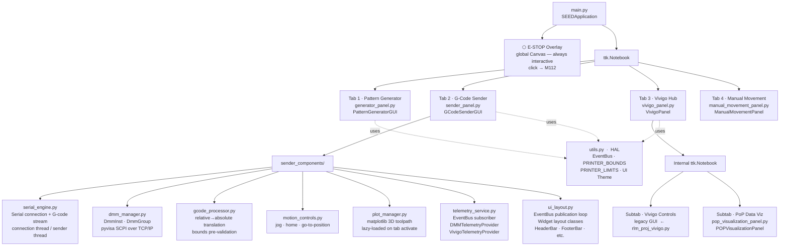
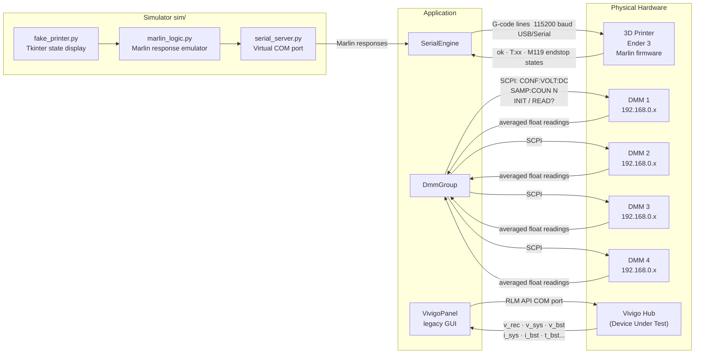
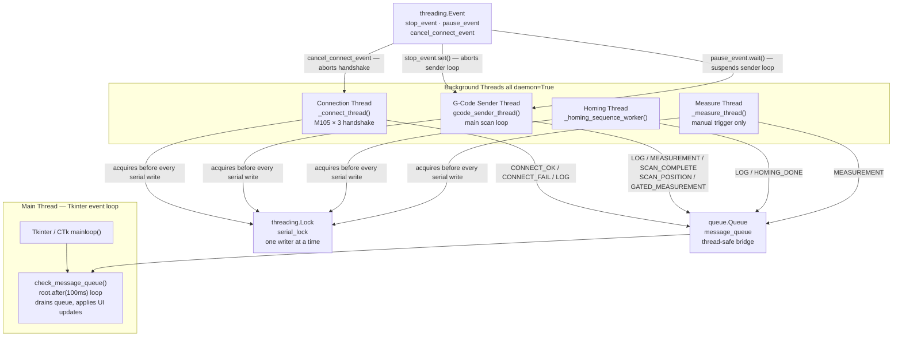
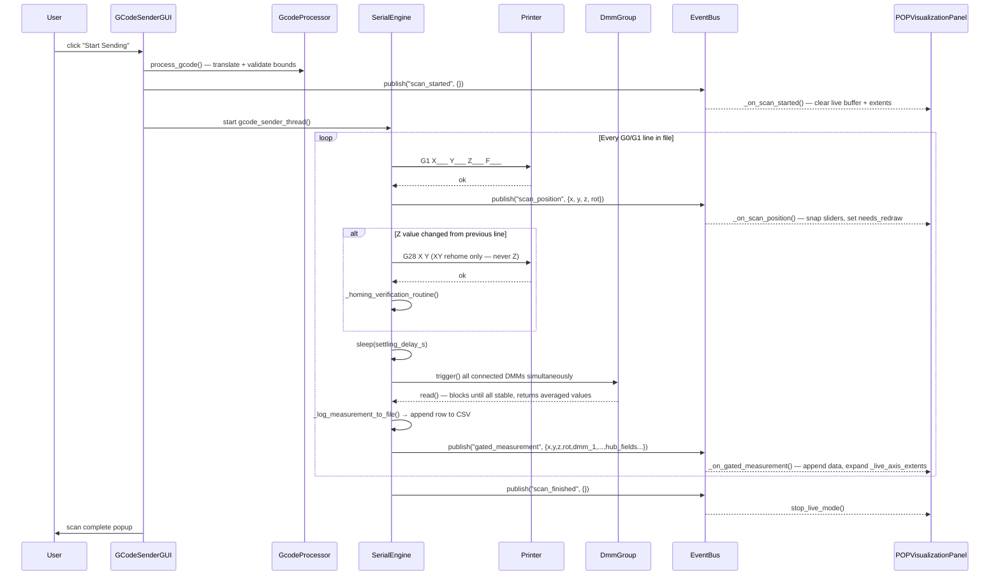
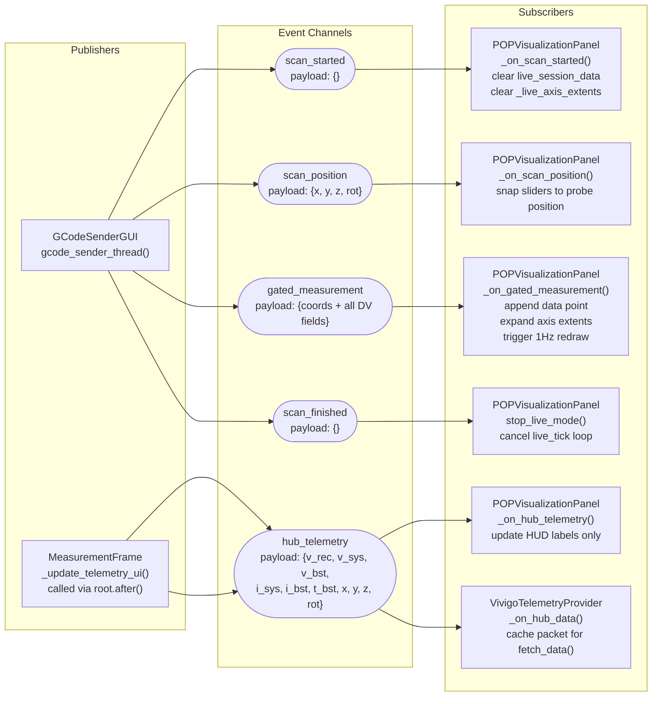
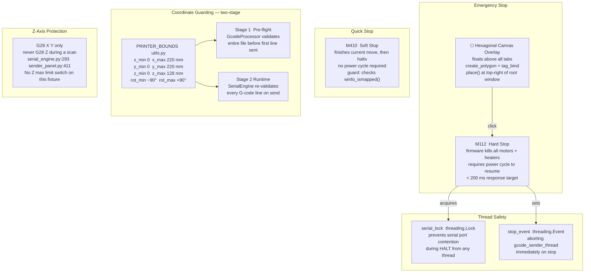
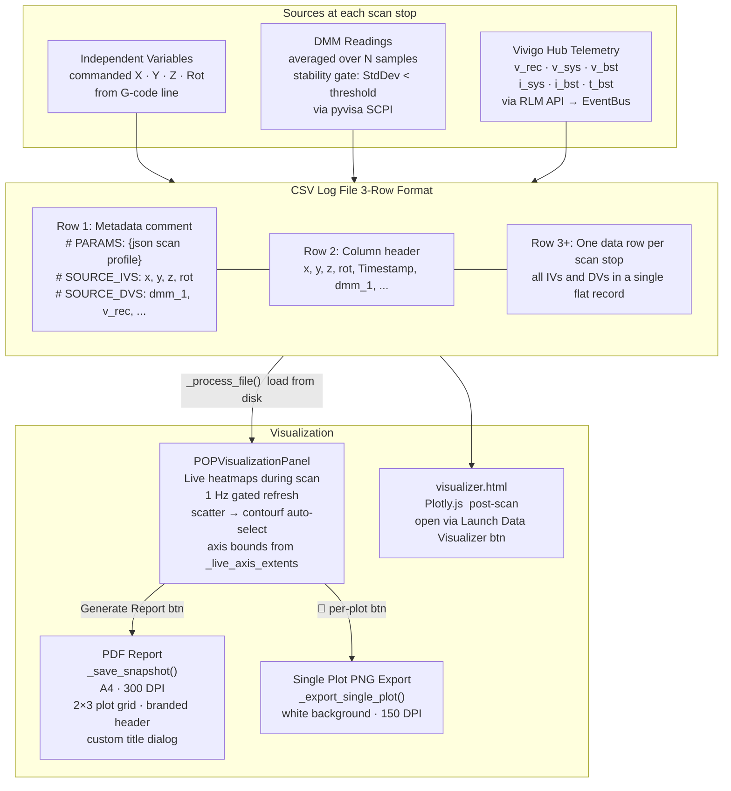

# SEED Control Center — Architecture Map

Seven diagrams covering the full system: application structure, hardware integration, threading, scan lifecycle, event bus, safety systems, and data output.

---

## 1 · Application Layer

Every panel is a `ttk.Frame` registered as a tab in the root `ttk.Notebook`. `SEEDApplication` owns the global **E-STOP overlay** — a canvas that floats above all tabs at all times.

---

## 2 · Hardware Integration

---

## 3 · Threading Model

Only the **main thread** may touch Tkinter widgets. All background threads communicate exclusively through `message_queue`. The `serial_lock` serializes every byte written to the physical COM port.

---

## 4 · Live Scan Lifecycle (Sequence)

One full automated scan from button-press to completion.

---

## 5 · EventBus Pub / Sub Map

`EventBus` lives in `utils.py`. It is a simple synchronous pub/sub — subscribers are called directly on the publishing thread.

---

## 6 · Safety Architecture

---

## 7 · Data Logging & Output Pipeline

